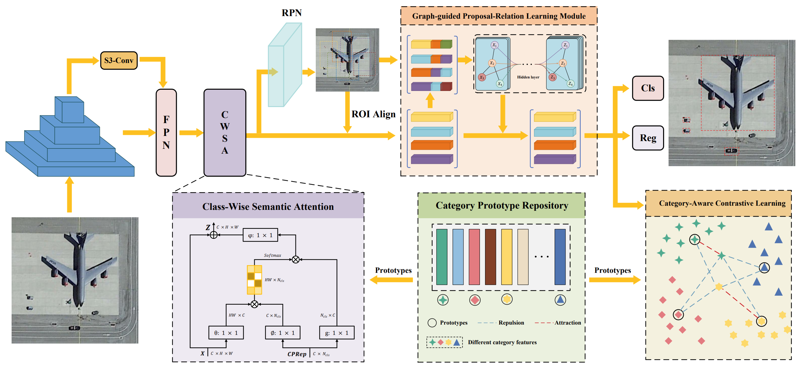

# PLNet-PR
This an official Pytorch implementation of our paper "**Object Detection in Remote Sensing Imagery Based on Prototype Learning Network with Proposal Relation**".
The specific details of the model are as follows.

****
# Datasets
- [DIOR](https://gcheng-nwpu.github.io/#Datasets)
is a large-scale benchmark dataset for object detection in optical remote sensing images, which consists of 23,463 images and 192,518 object instances covering 20 object classes annotated with horizontal bounding boxes. These 20 object classes are aircraft, airport, baseball field, basketball court, bridge, chimney, dam, highway rest area, highway toll station, port, golf course, ground track and field, footbridge, vessel, stadium, tank, tennis court, train station, vehicles, and windmill.
- [HRRSD](https://github.com/CrazyStoneonRoad/TGRS-HRRSD-Dataset)
contains 21,761 images acquired from Google Earth and Baidu Map with the spatial resolution from 0.15-m to 1.2-m. There are 55,740 object instances in HRRSD. HRRSD contains 13 categories of RSI objects. The 13 categories are: aircraft, baseball field, basketball court, bridge, intersection, athletic field, port, parking lot, ship, storage tank, T-intersection, tennis court, and car. Moreover, this dataset is divided as several subsets, image numbers in each subset are 5401 for ‘train’, 5417 for ‘val’, and 10943 for ‘test’.
- [NWPU VHR-10](https://gcheng-nwpu.github.io/#Datasets)
is a publicly available 10-class geospatial object detection dataset used for research purposes only. These ten classes of objects are airplane, ship, storage tank, baseballdiamond, tennis court, basketball court, ground track field, harbor, bridge, and vehicle. This dataset contains totally 800 very-high-resolution (VHR) remote sensing images that were cropped from Google Earth and Vaihingen dataset and then manually annotated by experts.
****
# Train on the DIOR
``` 
python tools/train.py configs/dior/faster-rcnn_r50_egrpl_ms_1x_dior.py
``` 
****
# Test on the DIOR
``` 
python tools/test.py configs/dior/faster-rcnn_r50_egrpl_ms_1x_dior.py [your_weight_path] --tta
``` 
****
# Results
All the results presented here are referenced from the original paper.
| Dataset | mAP (%) | 
| :----------: |:------:|
|     DIOR     |  75.8  | 
|    HRRSD     |  93.3  | 
|  NWPU VHR-10 |  95.6  |
****
# Citation
If you find this paper useful, please cite:
``` 
```
****
# Contact
TengFei Ma: [matengfei_1013@163.com](matengfei_1013@163.com)
